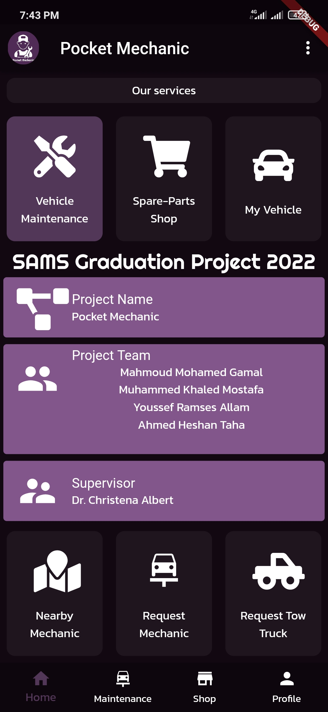
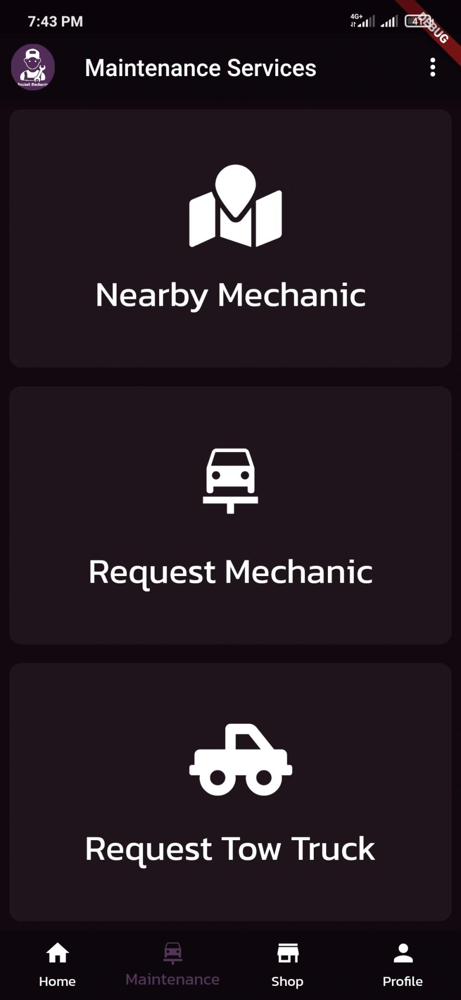
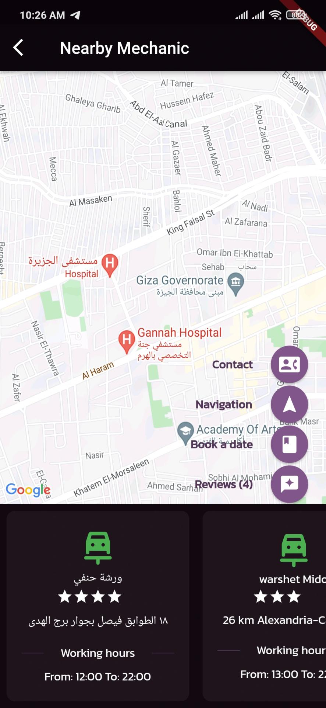
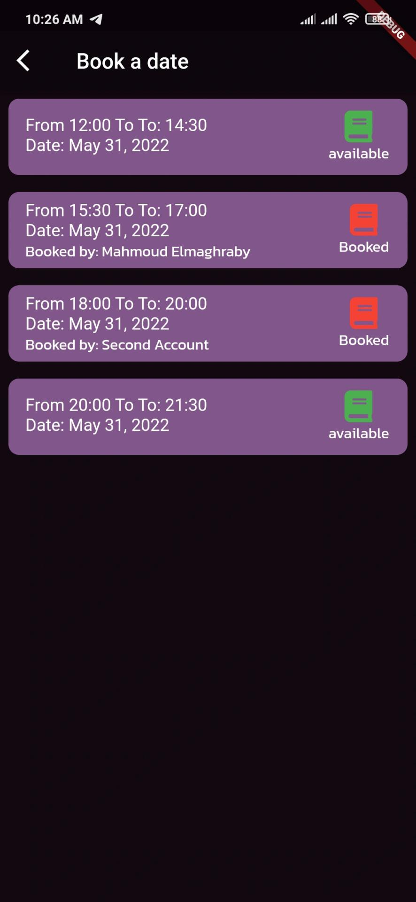
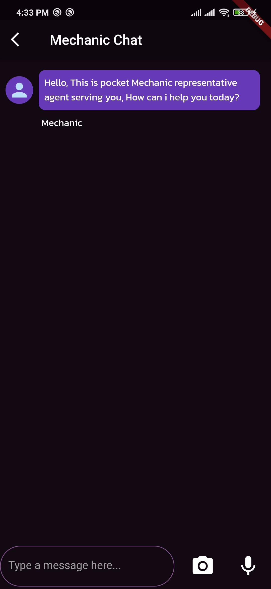
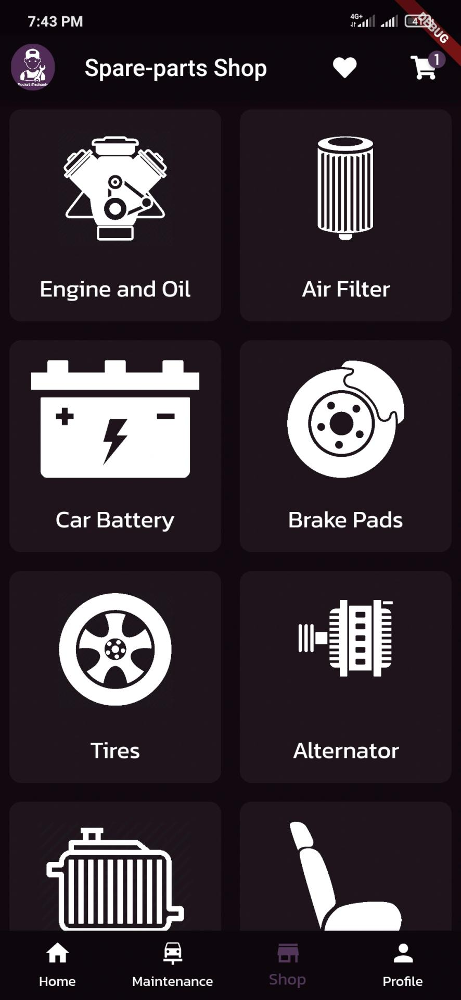
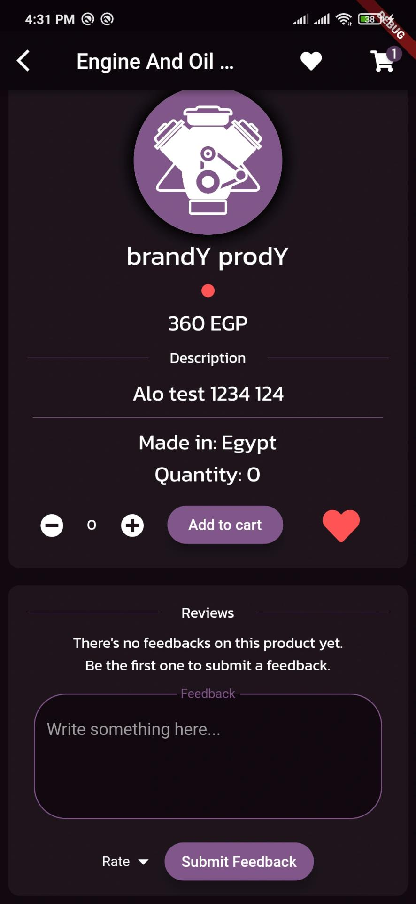
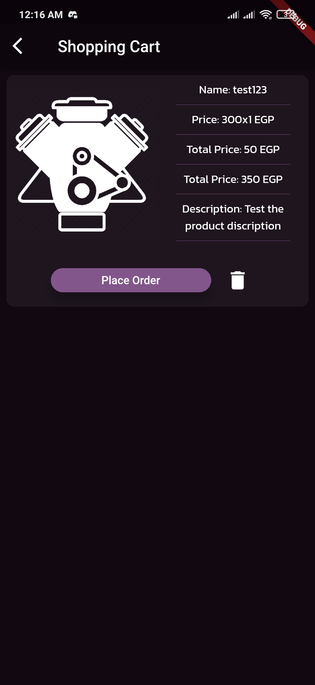
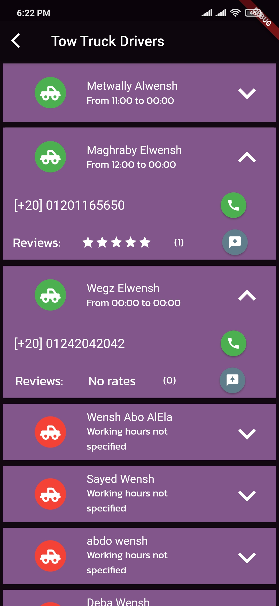
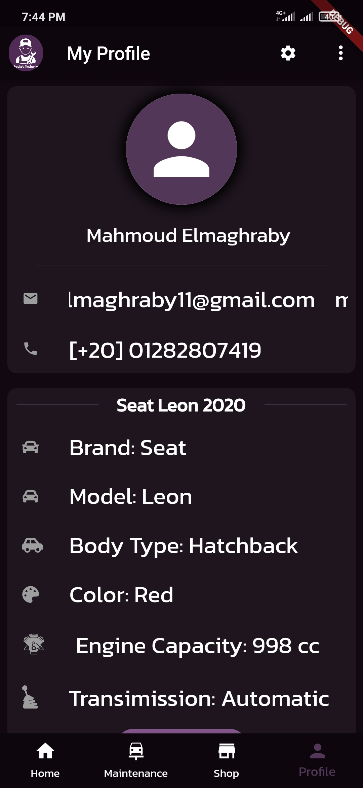

# Pocket Mechanic

Pocket Mechanic mobile application
Developed using Flutter framework & Dart language. 
Integrated with Firebase (Datebase & Authentication).

A cross-platform mobile application where the user can choose between a variety of vehicle 
maintenance services. 
Such as: Requesting a mechanic to do a checkup and perform their service on spot, viewing the 
nearest available mechanic and book a reservation date with, or the nearest available tow-truck driver around the user's location. In addition to, a section where the user can purchase spare-parts to their vehicle. 

The application consists of 4 systems, one for the customers, two other systems for the Partners, and system for the moderator. Each system integerated with eachother to provide high quality vehicle maintenance services to the customers.

## Tech Stack

**Client:** Flutter, Dart, Google Maps API

**Server:** Firebase (Authentication, Firestore DB)

## Screenshots

## 🚀 About Me

I’m Mahmoud Elmaghraby, a software developer specializing in frontend development with expertise in ReactJS/NextJS and cross-platform mobile development using React Native and Flutter. 
